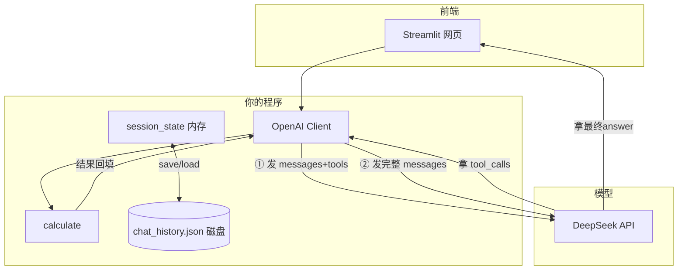
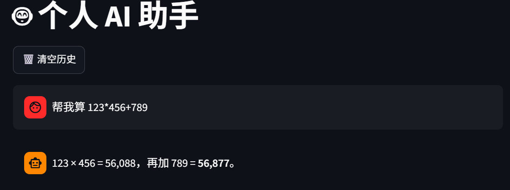
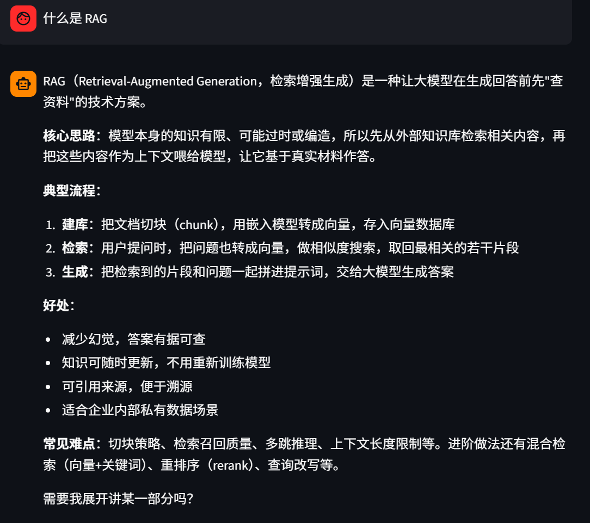

1.**概述**：这是一个可在网页运行的小型AI Agent。

2.**功能清单**：多轮对话/持久化记忆/工具调用（计算机）

3.**架构图**：

```mermaid
flowchart TB
    subgraph 前端
        UI[Streamlit 网页]
    end
    subgraph 你的程序
        CL[OpenAI Client]
        TOOL[calculate]
        MEM[session_state 内存]
        DISK[(chat_history.json 磁盘)]
    end
    subgraph 模型
        LLM[DeepSeek API]
    end
    UI-->CL
    CL-->|① 发 messages+tools| LLM
    LLM-->|拿 tool_calls| CL
    CL-->TOOL
    TOOL-->|结果回填| CL
    CL-->|② 发完整 messages| LLM
    LLM-->|拿最终answer| UI
    MEM <-->|save/load| DISK
```
4.**截图**:

5.**快速开始**:
装依赖 → 配 key → streamlit run